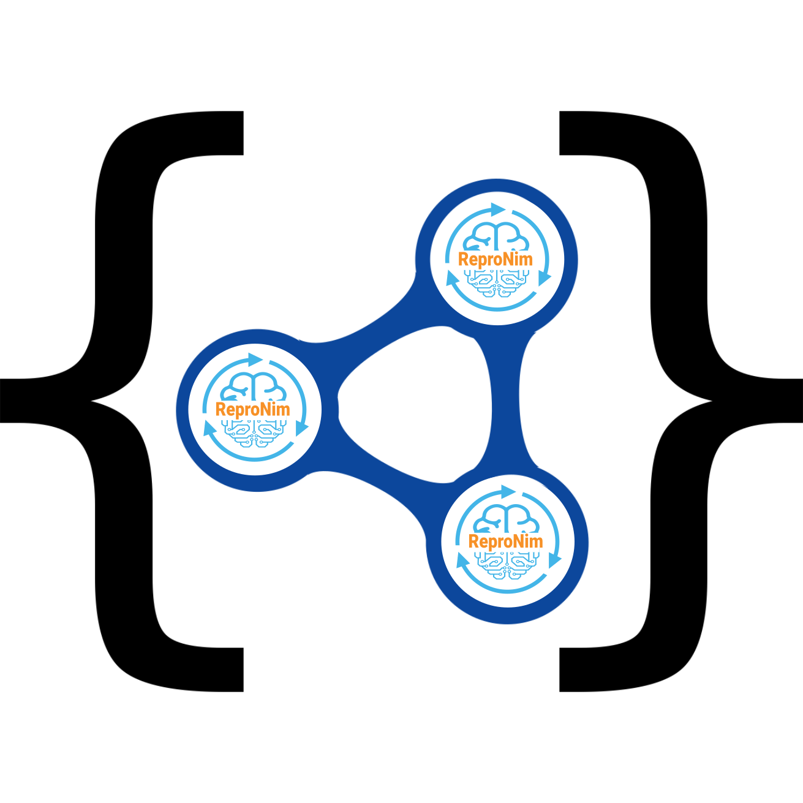

# Welcome to the Reproschema documentation

If you want to know more about the Reproschema check out our [introduction](./01_introduction.md).

If you are unfamiliar with such things as the semantic web or the JSON-LD format, head over to our [FAQ](./98_FAQ.md)

## Licence

 This work is licensed under a <a rel="license" href="http://creativecommons.org/licenses/by/4.0/">Creative Commons Attribution 4.0 International License</a>.

## Contributing and feedback

We are looking for people to:

- give us feedback on this documentation if anything is unclear
- to contribute to this documentation

Get in touch with us **TO DO**

If you want to get started right away, you can find the references and how-to
in the [about section](./100_about_this_doc.md)
