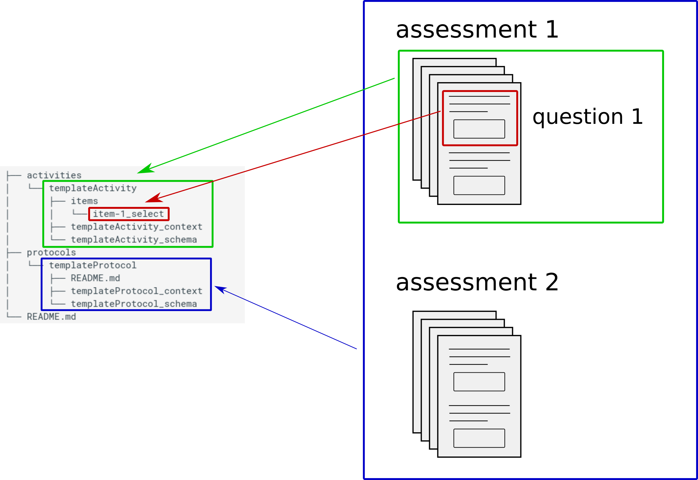

# Schema structure

## Style guides

{==⚠️ Note: All schema and context files above are saved without a `.jsonld` files extension. ⚠️ ==}

We recomment that the name the `protocol` and `activities` directory follow the `CamelCase` naming convention.

## Overall structure

The repronim schema is organized in a hierarchical manner with 3 levels with a schema for each level.

1.  The lowest level is the `item` level where each item represents a question from a given assessment.
On top of contain the text of the actual question, the schema at this level can contain additional
information such as the expected format of the item for the user interface: a boolean
(if this is a yes/no question), a multiple choice (with a list of the response choices),
a float or an integer (if a numerical value is expectd)...
This schema is defined by the [Field schema](https://raw.githubusercontent.com/ReproNim/reproschema/master/schemas/Field).

1.  The second level is the `activity` level that contains a set of items. This set would usually
constitute one assessment or questionnaire: for example all the items of the Edinburgh handedness inventory would
constitute one activity.
This schema is defined by the [Activity schema](https://raw.githubusercontent.com/ReproNim/reproschema/master/schemas/Activity).

1.  The highest level is the `protocol` level that originally define a set of activities to be
included in a given study.
This schema is defined by the [Protocol schema](https://raw.githubusercontent.com/ReproNim/reproschema/master/schemas/Protocol).




```
├── activities
│   └── templateActivity
│       ├── items
│       │   └── item-1_select
│       ├── templateActivity_context
│       └── templateActivity_schema
├── protocols
│   └── templateProtocol
│       ├── README.md
│       ├── templateProtocol_context
│       └── templateProtocol_schema
└── README.md
```

## Protocol

The protocol directory structure contains the following:

[TO DO]

## Activity

The activity directory structure contains the following:

-   `/items`: directory containing the jsonld files for individual items of the activity schema
    -   `item_1`
    -   `item_2`
    -   …
-   `activityName_schema` : schema to define the activity
-   `activityName_context` : context to define keys used specific to the activity schema
-   sub-activity jsonld schemas (if any)

The generic keys are defined in the generic context file (contexts/generic)
